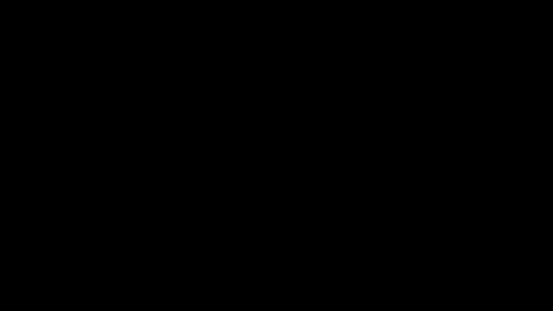

# Pixel Flow Mosaic (Python)

This project takes a **source image** (e.g., a selfie) and **rearranges its pixels** *without changing their RGB values* so that the final mosaic resembles a **target/stock image** in structure.

Pipeline :
1) preprocess images (square crop + resize)  
2) compute an **assignment permutation** (target positions → source pixels) using Lab-distance + edge-weighting + spatial penalty  
3) invert to per-source destinations  
4) simulate a smooth “flow” of moving seeds  
5) render each frame as a **Voronoi mosaic** (Jump Flood Algorithm) and export a GIF

---

## Output examples

### Source


### Target


### Output GIF (illustrative)


> The examples are generated from synthetic images in `examples/`.  
> The real outputs depend on `sidelen`, `iters`, and how detailed the target is.

---

## Installation

Python 3.10+ recommended.

```bash
pip install numpy pillow imageio torch
```

## Run

```bash
python main.py \
  --source path/to/source.jpg \
  --target path/to/target.jpg \
  --sidelen 96 \
  --frames 120 \
  --iters 800000 \
  --proximity 0.025 \
  --edge_alpha 4.0 \
  --out out.gif
```

---

## Parameter intuition

- `--sidelen` : resolution. Higher = better, slower (start 64 → 96 → 128).  
- `--iters` : swap-search iterations for the permutation. Higher = better match, slower.  
- `--proximity` : discourages long pixel moves. Too high can “freeze” the morph.  
- `--edge_alpha` : emphasizes target edges (eyes/mouth/silhouette). Too high can look noisy.  
- `--frames` : animation length (does not change the computed assignment).

