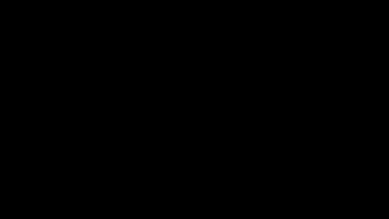

# Pixel Flow Mosaic

This project takes a **source image** and **rearranges its pixels** **without changing any RGB values** so that the final result **matches the *structure* of a target image**.

This is a “pixel-identity-preserving” transform.

## Algorithm Explanation

The system splits the problem into two stages:

1. **Decide the final layout (assignment / permutation).**  
   Solve a global “who-goes-where” problem: for each **target position**, pick exactly one **source pixel** to occupy it. This produces a **one-to-one permutation** of the source pixels.

2. **Turn that layout into motion + visuals.**  
   Once every pixel has a destination, simulate a smooth movement over time. Each frame is rendered by treating pixels as moving **seeds** and constructing a Voronoi mosaic using the **Jump Flood Algorithm (JFA)** for efficiency.

---

## Installation

Python 3.10+ recommended.

```bash
pip install numpy pillow imageio torch
```

## Run

```bash
python main.py \
  --source path/to/source.jpg \
  --target path/to/target.jpg \
  --sidelen 96 \
  --frames 120 \
  --iters 800000 \
  --proximity 0.025 \
  --edge_alpha 4.0 \
  --out out.gif
```

---

## Parameters

- `--sidelen` : Resolution. Higher = better, slower (start 64 → 96 → 128).  
- `--iters` : Swap-search iterations for the permutation. Higher = better match, slower.  
- `--proximity` : Discourages long pixel moves. Too high can “freeze” the morph.  
- `--edge_alpha` : Emphasizes target edges. Too high can look noisy.  
- `--frames` : Animation length (does not change the computed assignment).

